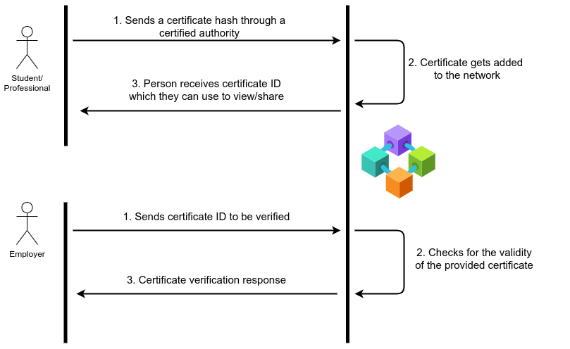

# CertNet
## Decentralized System for Certificate Verification using Blockchain

#### Contributors
* [Sumaid Syed](https://github.com/Sumaid)
* [Rohan Chacko](https://github.com/RohanChacko)
* [Meher Shashwat Nigam](https://github.com/ShashwatNigam99)
* [Adhithya Arun](https://github.com/adhithyaarun)
* [AadilMehdi Sanchawala](https://github.com/aadilmehdis)

Please view [INSTALL.md](https://github.com/Sumaid/certnet/blob/main/INSTALL.md) for installation and setup instructions.

### Running the application

#### Starting the blockchain network

* To start the RPC server

   ```bash
   npm run ganache &
   ```

* Deploy the smart contract to the blockchain network

   ```bash
   npm run contract-deploy
   ```

> Additionally, the other two steps can be performed using the Ganache GUI for better visualization. The steps are mostly straightforward. Note, the Gas Price should be set to 20 wei (default is a very large value).


#### Starting the web application

* Backend server
```bash
cd certnet/
npm start
```

* React frontend
```bash
 cd client/
 npm start
 ```

### Notes

* App runs on `http://localhost:3000/` by default

* Go to `Authentication` tab from navigation (top right)

* Log in with Google account. For demonstration purposes, you can choose a role between **Org** and **Student** when you register.

* If an Org role was chosen, you can navigate to the `Generate Certificate` tab where you can issue certificates to registered students.

* For an Org, `View Certificates` shows a list of certificates issued by the organization. For a Student, `View Certificates` shows all certificates issued to the student.

* The `Profile` tab shows details like name, email id, profile picture for both roles.

* Both `Profile` & `View Certificates` have public URLs; anyone with the URL should be able to access them without being registered users on the network.

* More documentation provided in [docs](https://github.com/Sumaid/certnet/tree/main/docs)

### Use case diagram

